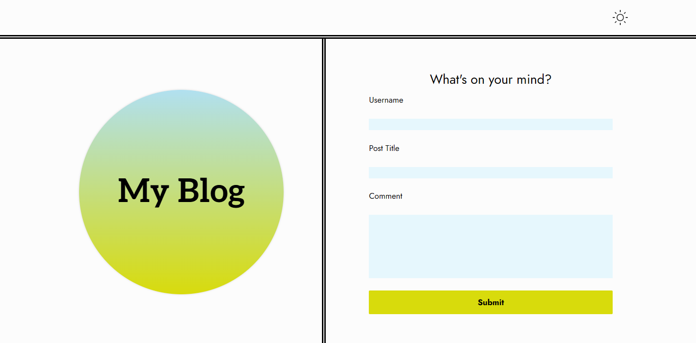
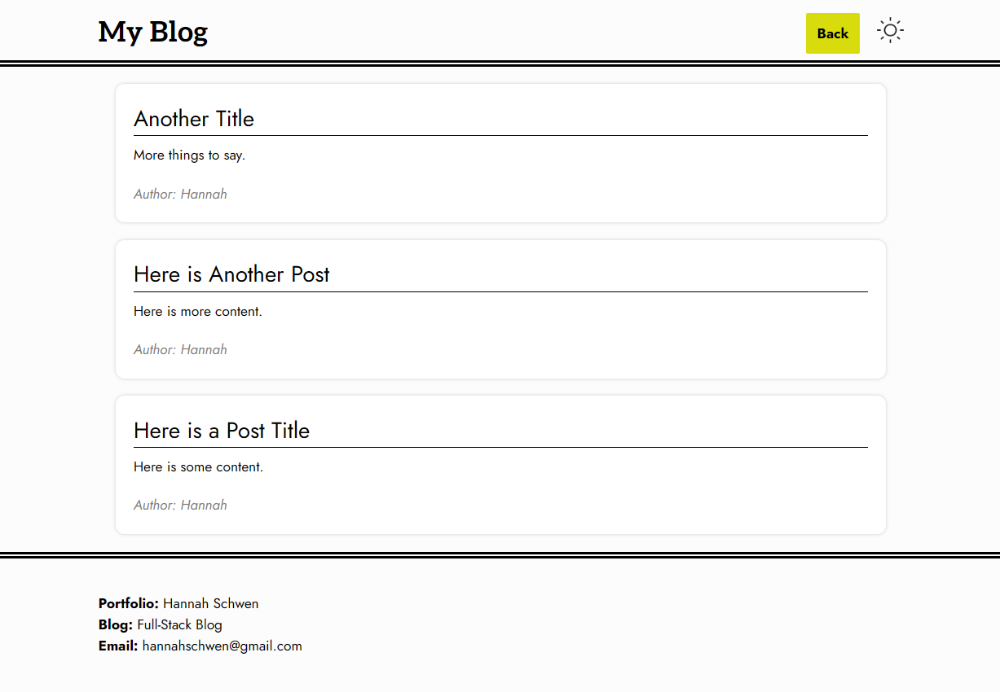

# Simple Blog

## Description

A two-page website where users can input and view blog posts.
The deployed application can be found here: https://hannahschwen.github.io/simple-blog/

## Usage

To create a new post, a user should fill out the form on the homepage. If any field is left blank, the user will be prompted to complete the form. Upon submitting the form, the user input is saved in local storage and the user is redirected to the blog page.

Screenshot of the homepage and form:

Once on the blog page, user input will be retrieved from local storage and displayed as blog posts. The posts will persist on page reload, but will only be visible to the user, as only local storage is used.

On either page, a user can click the sun icon in the top right corner to switch to dark mode. Once in dark mode, the sun icon will become a moon icon, which can be clicked to return to light mode.

The following screenshots show the blog entry page and blog post page, where a few posts are displayed:

